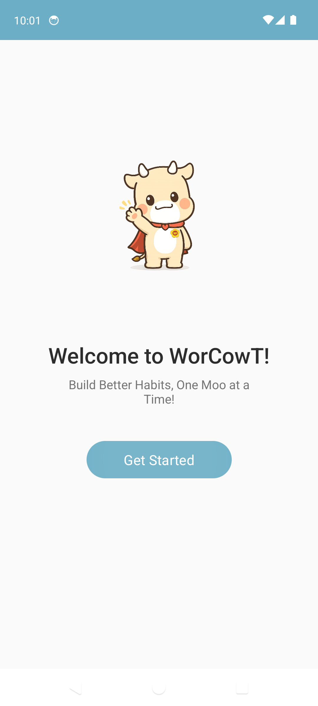
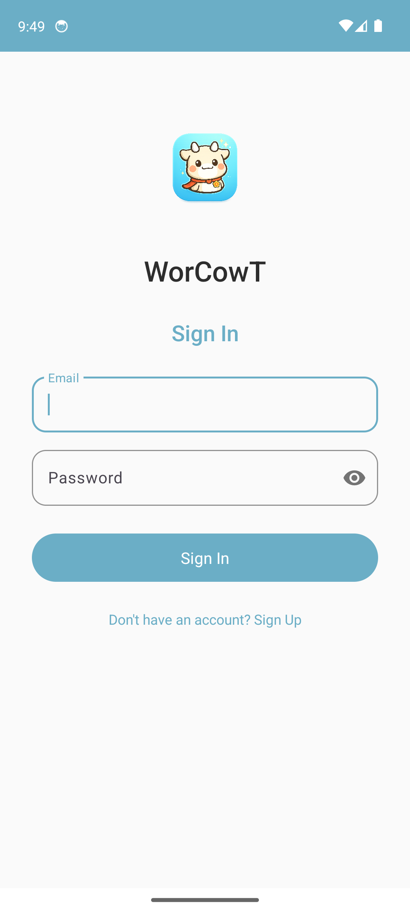
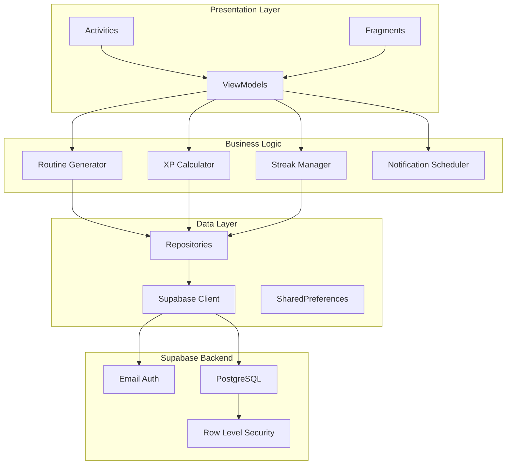
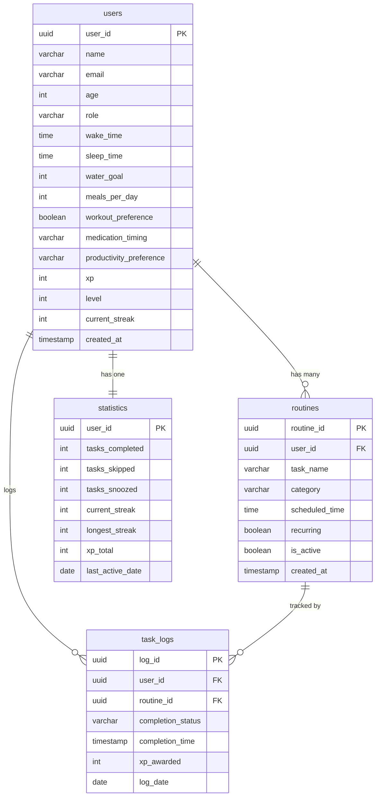
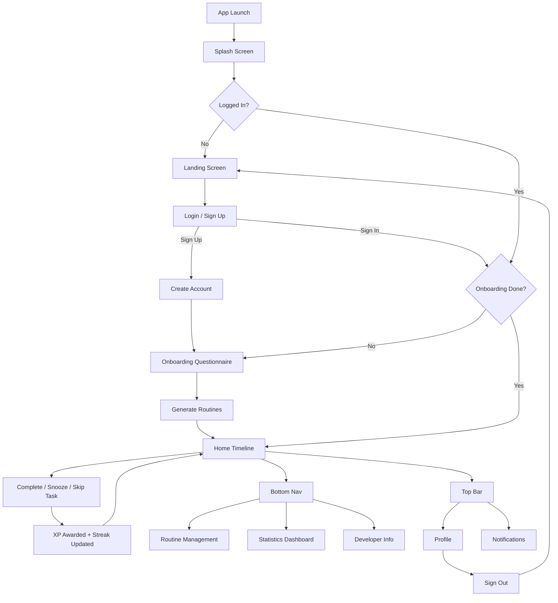

<p align="center">
  
</p>

<h1 align="center">WorCowT</h1>
<p align="center"><strong>Build Better Habits, One Moo at a Time!</strong></p>

<p align="center">
  
  
  
  
  
</p>

---

## Abstract

**WorCowT** is a gamified daily-routine and habit-tracking Android application designed to help students, professionals, and health-conscious individuals build and sustain productive habits. The app generates personalised daily schedules based on user preferences (wake/sleep times, water goals, workout habits, medication schedules) and motivates consistency through an XP and streak system. A friendly cow mascot guides users through every step, turning mundane self-improvement into a playful, rewarding experience.

---

## Problem Statement

In today's fast-paced digital world, maintaining a consistent daily routine is one of the most common struggles faced by students and young professionals. Existing productivity apps are either too complex, lack personalisation, or fail to sustain long-term engagement. Users abandon most habit trackers within the first week because the apps feel like chores rather than companions. There is a clear need for a simple, visually engaging, and gamified solution that adapts to individual lifestyles and keeps users motivated through positive reinforcement rather than guilt.

---

## Objectives

- Provide a **personalised routine generator** that adapts to each user's schedule, role, and lifestyle preferences.
- Implement a **gamification engine** (XP, levels, streaks) to sustain user engagement and reward consistency.
- Deliver **timely smart notifications** for water intake, workouts, medication, productivity blocks, and sleep.
- Offer a **clean, minimal, and playful UI** with a mascot-driven experience that feels approachable rather than clinical.
- Use a **cloud-first architecture** (Supabase) so user data is synced, backed up, and accessible across device resets.
- Track and display **progress statistics** so users can visualise their improvement over time.

---

## Features

| Feature | Description |
|---------|-------------|
| Email/Password Auth | Secure sign-up and sign-in via Supabase Authentication |
| Personalised Onboarding | 10-question questionnaire to tailor routines to the user |
| Routine Generator | Algorithm-driven daily schedule based on wake time, sleep time, and preferences |
| Timeline View | Vertical scrollable timeline with task cards showing name, time, and status |
| Task Actions | Complete, snooze, or skip any task -- each action is logged |
| XP and Levels | +10 XP per task, +50 daily bonus, +100 weekly streak; 5 level tiers |
| Streak Tracking | Consecutive-day tracking with streak break/recovery logic |
| Smart Notifications | AlarmManager-based exact reminders for water, workout, meds, productivity, sleep |
| Boot Persistence | Alarms automatically reschedule after device reboot |
| Statistics Dashboard | Numerical stats: XP total, tasks completed/skipped, current/longest streak |
| Mascot Companion | Friendly cow mascot with motivational messages throughout the app |
| Profile Management | View/edit profile, sign out |
| Developer Page | About the developer section |

---

## Screenshots

<p align="center">
  
  &nbsp;&nbsp;&nbsp;&nbsp;
  
</p>

<p align="center">
  <em>Left: Landing screen with mascot &nbsp;|&nbsp; Right: Email/Password sign-in</em>
</p>

---

## Software Requirements Specification (SRS)

### 1. Functional Requirements

| ID | Requirement | Priority |
|----|-------------|----------|
| FR-01 | The system shall allow users to register and authenticate using email and password | High |
| FR-02 | The system shall present a 10-step onboarding questionnaire on first login | High |
| FR-03 | The system shall generate a personalised daily routine based on onboarding answers | High |
| FR-04 | The system shall display routines as a vertical timeline with task cards | High |
| FR-05 | The system shall allow users to mark tasks as completed, snoozed, or skipped | High |
| FR-06 | The system shall award XP for completed tasks and apply penalties for snooze/skip | Medium |
| FR-07 | The system shall track daily streaks and compute longest-streak records | Medium |
| FR-08 | The system shall calculate user level based on cumulative XP thresholds | Medium |
| FR-09 | The system shall send scheduled notifications for upcoming tasks | High |
| FR-10 | The system shall reschedule notifications after device reboot | Medium |
| FR-11 | The system shall display a statistics dashboard with XP, streaks, and task counts | Medium |
| FR-12 | The system shall allow users to add, edit, and delete custom routines | Medium |
| FR-13 | The system shall persist all data to a cloud database (Supabase) | High |
| FR-14 | The system shall enforce row-level security so users can only access their own data | High |

### 2. Non-Functional Requirements

| ID | Requirement |
|----|-------------|
| NFR-01 | The app shall launch to the landing screen within 2 seconds on mid-range devices |
| NFR-02 | All network requests shall timeout gracefully after 15 seconds with user feedback |
| NFR-03 | The UI shall follow Material Design 3 guidelines for consistency and accessibility |
| NFR-04 | User passwords shall never be stored locally; authentication is handled by Supabase Auth |
| NFR-05 | The app shall function offline for viewing cached routines (cloud sync on reconnect) |
| NFR-06 | The APK size shall remain under 50 MB |

### 3. Hardware and Software Requirements

| Component | Requirement |
|-----------|-------------|
| OS | Android 7.0 (API 24) or higher |
| RAM | 2 GB minimum |
| Storage | 100 MB free space |
| Network | Internet connection required for authentication and data sync |
| Development IDE | Android Studio Ladybug (2024.3+) |
| Language | Kotlin 1.9+ |
| JDK | 17 or higher |
| Backend | Supabase (PostgreSQL, GoTrue Auth) |

---

## System Architecture

The application follows the **MVVM (Model-View-ViewModel)** pattern with a clean separation between presentation, business logic, and data layers.



---

## ER Diagram



---

## User Flow Diagram



---

## Tech Stack

| Layer | Technology |
|-------|-----------|
| Language | Kotlin 1.9 |
| UI Framework | Android Views + Material Design 3 |
| Architecture | MVVM with ViewModels and LiveData |
| Navigation | AndroidX Navigation Component |
| Networking | Ktor Client (CIO engine) |
| Serialization | Kotlinx Serialization (JSON) |
| Backend | Supabase (PostgreSQL + GoTrue Auth) |
| Supabase SDK | supabase-kt (GoTrue, Postgrest, Realtime, Storage) |
| Notifications | AlarmManager + BroadcastReceiver |
| Async | Kotlin Coroutines |
| Min SDK | API 24 (Android 7.0) |
| Target SDK | API 34 (Android 14) |

---

## Project Structure

```
WorCowt/
├── app/
│   └── src/main/
│       ├── java/com/worcowt/app/
│       │   ├── WorCowTApp.kt                  # Application class
│       │   ├── data/
│       │   │   ├── models/                     # Data classes (User, Routine, TaskLog, Statistics)
│       │   │   ├── repository/                 # CRUD repositories for each table
│       │   │   └── supabase/SupabaseManager.kt # Supabase client singleton
│       │   ├── engine/
│       │   │   ├── RoutineGenerator.kt         # Daily schedule algorithm
│       │   │   ├── XPCalculator.kt             # XP award/penalty logic
│       │   │   └── StreakManager.kt            # Streak continuation/break logic
│       │   ├── notifications/
│       │   │   ├── NotificationHelper.kt       # Alarm scheduling
│       │   │   ├── ReminderReceiver.kt         # BroadcastReceiver for alarms
│       │   │   └── BootReceiver.kt             # Reschedule after reboot
│       │   ├── ui/
│       │   │   ├── splash/                     # Splash screen
│       │   │   ├── landing/                    # Landing page with mascot
│       │   │   ├── auth/                       # Login / Sign Up
│       │   │   ├── onboarding/                 # 10-step questionnaire
│       │   │   ├── main/                       # MainActivity + bottom nav
│       │   │   ├── home/                       # Timeline view
│       │   │   ├── routine/                    # Routine management
│       │   │   ├── statistics/                 # Stats dashboard
│       │   │   ├── profile/                    # User profile
│       │   │   ├── developer/                  # About developer
│       │   │   └── workout/                    # Workout motivation
│       │   └── utils/
│       │       ├── Constants.kt                # App-wide constants
│       │       └── Extensions.kt               # Kotlin extensions
│       ├── res/
│       │   ├── drawable/                       # Mascot assets, icons
│       │   ├── layout/                         # XML layouts
│       │   ├── navigation/                     # Navigation graph
│       │   ├── menu/                           # Bottom nav menu
│       │   └── values/                         # Colors, strings, themes
│       └── AndroidManifest.xml
├── screenshots/                                # App screenshots
├── WorCowt-v0.1-debug.apk                     # Pre-built debug APK
├── build.gradle.kts                            # Project-level Gradle
├── settings.gradle.kts
├── gradle.properties
└── README.md
```

---

## Installation and Setup

### Prerequisites

- Android Studio Ladybug (2024.3+) or later
- JDK 17 or higher
- Android SDK with API 34 platform and build tools

### Steps

1. **Clone the repository**

```bash
git clone https://github.com/to-sayana/WorCowt.git
cd WorCowt
```

2. **Open in Android Studio**

   File > Open > select the `WorCowt/` directory. Gradle will sync automatically.

3. **Configure local.properties**

   Ensure `local.properties` contains the correct SDK path:
   ```
   sdk.dir=/path/to/your/Android/Sdk
   ```

4. **Build the APK**

```bash
./gradlew assembleDebug
```

   Output: `app/build/outputs/apk/debug/app-debug.apk`

5. **Run on Emulator or Device**

   - Create an AVD (Pixel 7, API 34) via Device Manager, or
   - Connect a physical Android device with USB debugging enabled
   - Click **Run** in Android Studio

### APK Download

A pre-built debug APK is available in the repository root:

[**WorCowt-v0.1-debug.apk**](WorCowt-v0.1-debug.apk)

---

## XP and Level System

| Level | XP Required | Title |
|-------|-------------|-------|
| 1 | 0 | Newborn Calf |
| 2 | 200 | Growing Calf |
| 3 | 500 | Strong Bull |
| 4 | 900 | Mighty Ox |
| 5 | 1,500 | Legendary Moo |

| Action | XP |
|--------|-----|
| Complete a task | +10 |
| Complete all daily tasks | +50 |
| 7-day streak bonus | +100 |
| Snooze a task | -5 |
| Skip a task | -3 |

---

## Database

- **Provider**: [Supabase](https://supabase.com) (managed PostgreSQL)
- **Authentication**: Email/Password via Supabase GoTrue
- **Security**: Row-Level Security (RLS) policies ensure each user can only read/write their own rows
- **Tables**: `users`, `routines`, `task_logs`, `statistics` (see ER Diagram above)

---

## Version History

| Version | Date | Notes |
|---------|------|-------|
| v0.1-debug | March 2026 | Initial release -- core features: auth, onboarding, routine generation, timeline, XP/streaks, notifications, statistics |

---

## Authors

Developed as a personal productivity project.

---

## License

This project is for educational and personal use.
